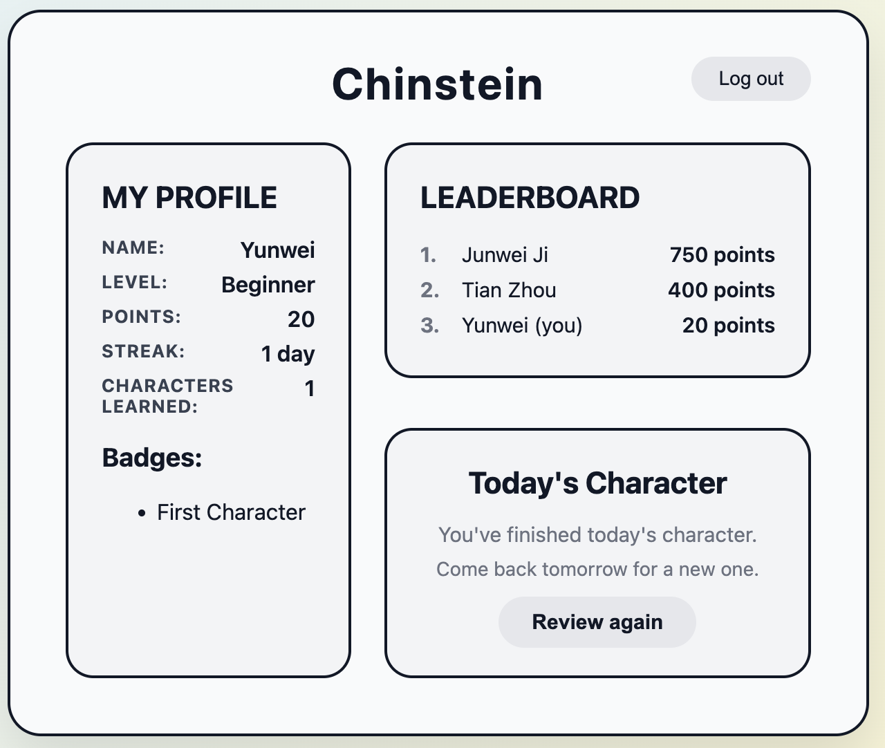
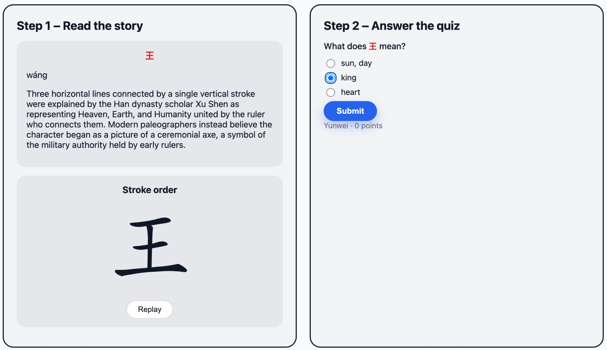

# Chinstein

Learn one Chinese character a day — a short story about where it came from, and one quiz question.

**Live demo:** [chinstein.vercel.app](https://chinstein.vercel.app)

Signing up needs an email and a password, nothing else. The API is on Render's free tier, which
sleeps after 15 minutes, so the first request can take a minute while it wakes up. Sorry about that.



## Why I built this

I kept watching people around me download a language app, use it enthusiastically for two weeks, and then quit. The apps weren't bad — but a session felt like homework. Long word lists, big daily goals, and a streak you feel guilty about breaking.

I wanted to see what happens if a session is deliberately tiny: one character a day, a short story about where it comes from, and a single quiz question. Two or three minutes, not twenty.

It started as a Figma prototype for an HCI course. Since then I've rebuilt it as a real
application — React on the front, an Express API that owns the business logic, Postgres
underneath, and accounts so your progress isn't stuck in one browser.

## Features

- One character a day, picked by date, the same for everyone
- Etymology story and a stroke-order animation
- Quiz with wrong options pulled from characters you've already seen
- Email/password accounts, JWT sessions
- Points, streaks, badges
- One submission per day



## How it's put together

```
Browser  →  Vercel   React 19 + TypeScript, built by Vite
         →  Render   Express 5 + TypeScript, one long-lived process
         →  Neon     PostgreSQL 17
```

Three pieces, three hosts. The reason they're separate isn't cost — it's that the browser can't be
allowed anywhere near the database credentials. The API sits in the middle so it can check who
you are before letting you touch anything.

## Some decisions I'd defend in a code review

**I only ever write one kind of row.** `study_sessions` gets a row when you finish a session, and
that's it. Points, streak, level, badges, and the list of characters you've learned are all
computed when you ask for them. I did it this way because a stored counter eventually disagrees
with the rows it's supposed to summarise, and then you have a bug you can't reproduce. The side
benefit is that changing a badge rule applies retroactively without a migration.

**The client doesn't get to decide anything.** When you submit a quiz answer the request body is
just `{ characterId, answer }`. The server looks up the correct meaning itself, works out the
score itself, and stamps the date from Postgres `CURRENT_DATE` so you can't backfill a streak.
`GET /api/characters/today` leaves the `meaning` field out of the response entirely, so the answer
never reaches the browser. After I added auth, the user id comes out of the JWT signature — the
client can't even claim to be someone.

**Uniqueness is the database's job.** Two things can only happen once: one session per user per
day, one account per email. The obvious way to write that is `SELECT` to check, then `INSERT` —
which breaks the moment two requests arrive together and both see "doesn't exist". So I insert
straight away and catch Postgres error `23505`, turning it into a `409`. I hit this same shape
three times in this project and it took me until the third to notice it was the same problem.

**Streaks are a SQL query, not a column.** Finding consecutive days uses the gaps-and-islands
trick: subtract a row number from each date, and dates in a run collapse to the same value, so
grouping by it gives you the runs. The latest run only counts if it reaches today or yesterday.
It's one query over the detail rows, and there's no counter to keep correct on every write.

**Four states, not three booleans.** The user fetch in `App.tsx` is modelled as

```ts
type Async<T> =
  | { status: 'loading' }
  | { status: 'unauthenticated' }
  | { status: 'error'; message: string }
  | { status: 'success'; data: T }
```

Three separate booleans would let me write five combinations that make no sense. This lets me
write four, and TypeScript narrows `data` for free inside the success branch.

Treating `unauthenticated` as a normal state rather than an error turned out to save code: I never
wrote an "am I logged in?" check, because fetching the profile answers that question. A 401 just
means show the login page.

**The production image only carries what it needs to run.** The API's Dockerfile builds in two
stages: the first installs everything, compiles TypeScript, then prunes the dev dependencies; the
second starts from a clean base and copies over only `dist` and the remaining `node_modules`. The
compiler, the type definitions and the `.ts` sources never reach production — 82 MB compressed
instead of several hundred. Ordering matters too: `package.json` is copied and installed before the
sources, so editing a route doesn't invalidate the dependency layer.

`CMD` uses the exec form so Node runs as PID 1 and receives SIGTERM directly, and the server handles
it — closing the listener, letting in-flight requests finish, then draining the Postgres pool.
`docker stop` went from 3.1 seconds to 0.14, but the real point is that a deploy no longer cuts
requests off mid-flight.

## API

Everything except health and the two auth routes needs `Authorization: Bearer <token>`.

| Method | Path | Notes |
| --- | --- | --- |
| `GET` | `/api/health` | Checks the database too, not just the process |
| `POST` | `/api/auth/register` | `409` if the email is taken |
| `POST` | `/api/auth/login` | Same error message whatever went wrong, so you can't probe for valid emails |
| `GET` | `/api/me` | Profile, with everything derived |
| `GET` | `/api/characters/today` | Character, story, quiz options — no answer |
| `POST` | `/api/sessions` | Server grades it; `409` if you already went today |

Passwords go through bcrypt at cost 10. Request bodies are validated with zod. Queries are all
parameterised.

Both auth routes are rate limited per IP — ten login attempts per fifteen minutes, counting
failures only so a successful login never costs you a slot, and ten new accounts per hour. The
counters live in process memory, which is fine on a single instance and would need Redis the
moment there were two.

## Stack

| Layer | What I used |
| --- | --- |
| Frontend | React 19, TypeScript, Vite, React Router v7 |
| Styling | Hand-written CSS — custom properties, flexbox, grid |
| Backend | Express 5, TypeScript (ESM), zod, `pg` |
| Auth | bcrypt, jsonwebtoken |
| Database | PostgreSQL 17 |
| Stroke animation | Hanzi Writer |
| Hosting | Vercel (web), Render (API), Neon (database) |
| Build & CI | Docker (multi-stage), GitHub Actions |

## Running it locally

Node 20+ and Docker.

```bash
git clone https://github.com/Yunwei-93/chinstein.git
cd chinstein

docker compose up -d              # Postgres on :5432

cd server
cp .env.example .env              # the defaults point at the local database
npm install
npm run migrate                   # create tables
npm run seed                      # load the 50 characters
npm run dev                       # API on :3000

cd ../client
npm install
npm run dev                       # UI on :5173
```

Both `migrate` and `seed` are safe to re-run.

`server/.env` wants four values. `.env.example` has ones that work locally:

| Variable | What it's for |
| --- | --- |
| `DATABASE_URL` | Postgres connection string |
| `JWT_SECRET` | Signing key — generate a real one with `openssl rand -base64 32` |
| `JWT_EXPIRES_IN` | Token lifetime, e.g. `7d` |
| `CORS_ORIGIN` | Comma-separated list of allowed origins |

To run the API the way production does, build the image instead:

```bash
cd server
docker build -t chinstein-api .
docker run --rm -p 3001:3000 --env-file .env.docker chinstein-api
```

Point `DATABASE_URL` at a managed database rather than the local container — inside the container
`localhost` means the container itself, not your machine.

## Continuous integration

Every push to `main` and every pull request against it runs two parallel jobs — one per package —
that install from the lockfile, lint, type-check and build. `main` is protected: changes go through
a pull request and both checks have to be green before it can be merged. The bypass list is empty,
so that applies to me too.

There are no automated tests yet, which is the honest gap in this setup; the pipeline is where they
will go.

## Layout

```
client/src/
├── components/     ProfileRow, BadgeList, TodayCard, Leaderboard, StrokeAnimation
├── pages/          HomePage, StudyPage, ResultPage, LoginPage
├── api.ts          every fetch call in the app lives here
├── types.ts        mirrors the API responses
└── App.tsx         routing, the async user fetch, the refetch callback

server/
├── db/schema.sql   characters / users / study_sessions
└── src/
    ├── app.ts          routes and nothing else
    ├── auth.ts         bcrypt, JWT, the requireAuth middleware
    ├── characters.ts   daily pick; the client-facing version drops the answer
    ├── users.ts        profile assembly and the streak query
    ├── sessions.ts     grading, scoring, custom error classes
    ├── badges.ts       badge rules
    ├── db.ts           connection pool
    └── scripts/        migrate, seed
```

Routes call business logic, business logic calls the database, and never the other way round. The
business modules don't import `req` or `res` at all, which means I can test them without starting
a server — once I write those tests.

## Roadmap

- [x] 50 characters with daily rotation
- [x] Routing, stroke animations, quiz and scoring
- [x] Express + TypeScript API on PostgreSQL
- [x] Accounts and JWT auth
- [x] Deployed end to end
- [x] Rate limiting on the auth routes
- [ ] A real leaderboard endpoint
- [ ] Integration tests (supertest + PGlite)
- [x] Docker and GitHub Actions
- [ ] Claude API for generating etymology
- [ ] Spaced repetition

## What's not done

- **Rate limiting is per IP and per process.** It stops casual brute force, but anyone with a
  proxy pool walks around it, and a shared office or campus IP gets throttled unfairly. Account-level
  limits and a captcha would be the next layer.
- **The leaderboard is fake.** The other two users are hard-coded in `HomePage`. Slightly funny
  that it only became worth building for real once there were accounts.
- **"Today" is whatever the server says it is.** Every date now comes from one clock, which fixed
  a bug where the browser and the database disagreed about whether you'd studied. But it means
  someone in Tokyo gets a new character at 9am local, not midnight. Proper fix is storing each
  user's timezone.
- **Getting the quiz wrong costs you the day.** The one-row-per-day constraint stops duplicate
  submissions, which is what I wanted, but it also means no second try and you never find out the
  right answer. I tied "one submission" and "one chance to learn" together without meaning to.
- **Two copies of `types.ts`.** Client and server are separate npm packages and I sync them by
  hand.
- **No tests right now.** The badge unit tests went away when that logic moved to the server and I
  haven't written the backend ones yet.
- **Stroke data comes from a CDN.** Hanzi Writer fetches it from jsDelivr at runtime. Bundling 50
  characters locally would drop the dependency.
